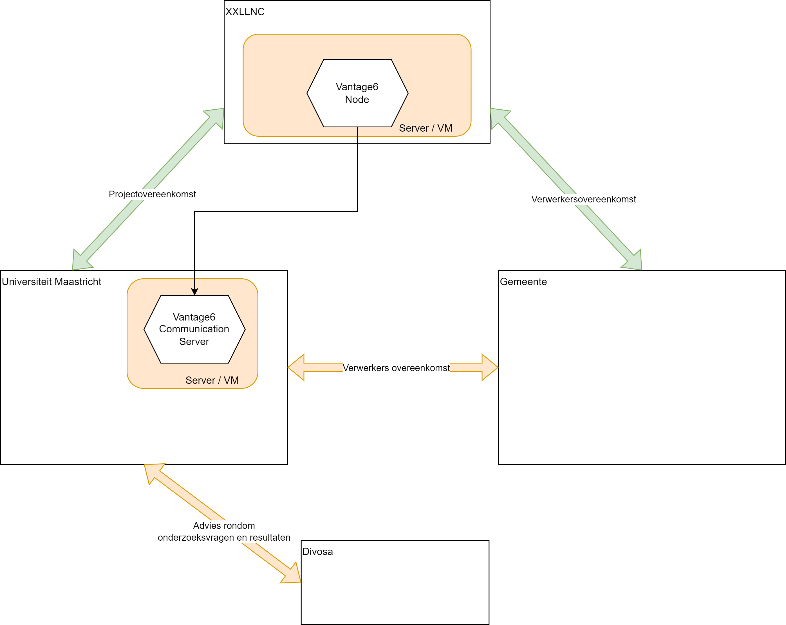

# Deelname aan analyse effectiviteit van Vroegsignalering Schulden

Gemeenten spelen een cruciale rol bij het vroegtijdig signaleren en aanpakken van schulden onder inwoners. Nieuwe technologieën, zoals Federated Learning, bieden innovatieve manieren om de effectiviteit van deze vroegsignalering te onderzoeken zonder de privacy van burgers in gevaar te brengen. Wij nodigen uw gemeente uit om deel te nemen aan een project dat gebruikmaakt van deze technologie.

## Wat willen we onderzoeken in dit project?

Tijdens dit project willen we het lange-termijn effect van vroegsignalering onderzoeken. Bestaand onderzoek focussed zich op het aantal meldingen, dossiers en het accepteren van hulp. In dit onderzoek willen we inzichtelijk krijgen of het accepteren van hulp ook leidt tot minder signalen in de toekomst.

De twee specifieke onderzoeksvragen waar we een antwoord op willen geven zijn:

1. Wat is de effectiviteit (gemeten als geen of minder signalen in de toekomst) van de huidige vroegsignalering?
2. Wat is de effectiviteit van specifieke contactmethoden (bijvoorbeeld het sturen van een brief, bellen, of huisbezoeken)?
3. Wat is het verschil in effectiviteit tussen verschillende drempelwaarden (bijvoorbeeld de hoogte van het schuldbedrag, of het aantal meldingen) van specifieke contactmethoden?

De informatie voor deze onderzoeksvragen bevindt zich bij uw software dienstverlener (bijvoorbeeld XXLLNC). Dit betekent dat we de uitvoering van het onderzoek in dit project met deze dienstverlener kunnen afhandelen, waarbij de deelnemende gemeenten extra inzicht krijgen in de vroegsignalering. Omdat deze dienstverlener in opdracht werkt van de gemeente, moeten we voor dit onderzoek een verwerkersovereenkomst sluiten met de deelnemende gemeenten.

Onderstaand staan nog verdere technische en juridische details uitgelegd.

## Wat wordt er gevraagd van de gemeente?

De gemeente *mag* actief deelnemen in het onderzoek, maar alleen als daar behoeft aan is. Aangezien de data bij een externe dienstverlener staat, heeft Universiteit Maastricht alleen toestemming nodig om de data beschikbaar bij de externe dienstverlener te analyseren. Er wordt **niet** gevraagd om extra data te verzamelen door de gemeente. Het onderzoek wordt uitgevoerd met de informatie die regulier wordt verzameld in het werkproces. Dit betekent dan ook dat er geen extra werkzaamheden nodig zijn vanuit de gemeente, met uitzondering van de toestemming (in de vorm van een verwerkersovereenkomst).
Aangezien dit project wordt gefinancierd door het Ministerie van Binnenlandse Zaken wordt er **geen financiële bijdrage gevraagd** van de deelenmende gemeenten.

### Wetenschappelijke publicatie
Resultaten van het onderzoek worden altijd met de gemeente gedeeld, waarbij de andere gemeenten niet bij naam worden genoemd. Bij wetenschappelijke publicatie zullen de deelnemende gemeenten niet bij naam worden genoemd. Mocht het interessant zijn voor de gemeente kan iemand als co-auteur op deze wetenschappelijke publicatie meegenomen worden.

## Wat is Federated Learning?

Federated Learning is een vorm van machine learning waarbij modellen worden getraind op gedistribueerde data, zonder dat deze data centraal wordt verzameld. In plaats van gegevens naar een centraal model te sturen, wordt het model naar de data gebracht. Dit betekent dat gevoelige informatie binnen de infrastructuur van de dienstverlener (bijvoorbeeld XXLLNC) blijft, terwijl toch geanonimiseerde inzichten kunnen worden gedeeld voor gezamenlijke analyses.

### Voordelen voor uw gemeente

- **Privacybescherming**: Uw data blijft binnen de infrastructuur van de dienstverlener, waardoor de privacy van inwoners gewaarborgd blijft.
- **Inzichten in Vroegsignalering**: Door deelname ontvangt uw gemeente gratis inzichten in de effectiviteit van uw huidige vroegsignaleringsmethoden, wat kan leiden tot verbeterde ondersteuning voor inwoners met (beginnende) schulden.
- **Innovatie en Samenwerking**: U maakt deel uit van een innovatief project dat samenwerking tussen gemeenten stimuleert en bijdraagt aan de ontwikkeling van geavanceerde analysemethoden.

### Rol van de dienstverlener

In dit project maakt uw gemeente gebruik van de diensten van een gespecialiseerde dienstverlener. Zij ontvangen de gegevens en zorgen voor de technische infrastructuur die nodig is voor de toepassing van Federated Learning. De data blijft binnen hun infrastructuur, wat bijdraagt aan de bescherming van de privacy van uw inwoners.

### Benodigde overeenkomst
In onderstaand figuur is uitgelegd hoe de relatie tussen de dienstverlener (XXLLNC), de gemeente en Universiteit Maastricht (UM) is vormgegeven vanuit het oogpunt van benodigde overenkomsten.

Op basis van dit figuur is dan ook een verwerkersovereenkomst nodig tussen de deelnemende gemeente en Universiteit Maastricht. Deze overeenkomst waarborgt dat de verwerking van persoonsgegevens in overeenstemming is met de Algemene Verordening Gegevensbescherming (AVG) en legt de afspraken vast tussen de verwerkingsverantwoordelijke (gemeente) en de verwerker (UM).

## Hoe deel te nemen?

Geïnteresseerde gemeenten kunnen contact opnemen met de Universiteit Maastricht via [dit formulier](https://wkf.ms/3MLxWOP) waarna er contact wordt opgenomen.